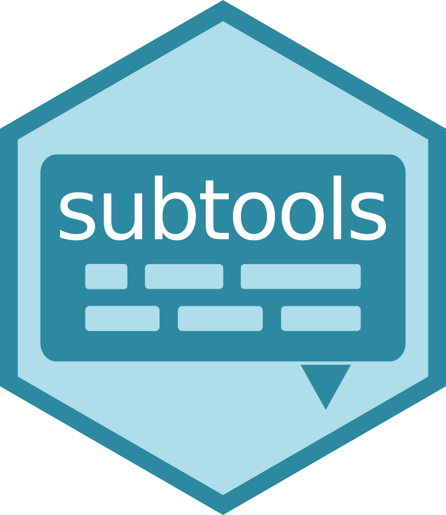

<!-- README.md is generated from README.Rmd. Please edit that file -->

```{r, include = FALSE}
knitr::opts_chunk$set(
  collapse = TRUE,
  comment = "#>",
  fig.path = "man/figures/README-",
  out.width = "100%"
)
```



# subtools
[](https://travis-ci.org/fkeck/subtools)

### Read, write and manipulate subtitles in R

Hi! Here, you will find some basic informations to get started with `subtools`. For more details, you can check the package documentation.

Subtools is a R package to read, write and manipulate subtitles in R. This then allows the full range of tools offered by the R ecosystem to be used for the analysis of subtitles. With version `1.0`, `subtools` integrates the main principles of the tidyverse and integrates directly with `tidytext` for a tidy approach of subtitle text mining.

### Install
To install the package from Github you can use devtools:

    devtools::install_github("fkeck/subtools")


```{r}
library(subtools)
library(tidytext)
```


### Reading subtitles

The main goal of subtools is to provide a seamless way to import subtitle files directly into R. This task can be performed with the function `read_subtitles()`:


```{r, include = FALSE}
oss_file <- system.file("extdata", "ex_oss117.srt", package = "subtools")
rushmore_file <- system.file("extdata", "ex_rushmore.srt", package = "subtools")
bb_file <- system.file("extdata", "ex_breakingbad.srt", package = "subtools")

rushmore_sub <- read_subtitles(rushmore_file)
oss_sub <- read_subtitles(oss_file)
bb_sub <- read_subtitles(bb_file, metadata = data.frame(Name = "Breaking Bad", Season = 1, Episode = 1))

```

```{r, eval=FALSE}
rushmore_sub <- read_subtitles("ex_Rushmore.srt")
oss_sub <- read_subtitles("ex_OSS_117.srt")

```


```{r}
rushmore_sub

oss_sub
```

The function `read_subtitles()` returns an object of class `subtitles`. This is a simple `tibble` with at least four columns ("`ID`", "`Timecode_in`", "`Timecode_out`" and "`Text_content`").

The metadata are handled by adding extra-columns which can be used during the analysis. You can add metadata by adding columns manually (e.g. using `mutate()`). You can also provide a 1-row data.frame of metadata to the function `read_subtitles()`.

```{r, eval=FALSE}
bb_meta <- data.frame(Name = "Breaking Bad", Season = 1, Episode = 1)
bb_sub <- read_subtitles("ex_Breaking_Bad.srt", metadata = bb_meta)
```

```{r}
bb_sub
```


##### Series

If you want to analyze subtitles of series with different seasons and episodes, you will have to import many files at once. The `read_subtitles_season()`, `read_subtitles_serie()` and `read_subtitles_multiseries()` functions can make your life much easier, by making it possible to automatically import files and extract metadata from a structured directory. You can check the manual for more details.

##### MKV

Finally if you have a collection of movies in .mkv format, you can extract the subtitle tracks of MKV files with `read_subtitles_mkv()`.


### Cleaning subtitles

Often, the workflow begins with a cleaning step to get rid of irrelevant information that might be present in text content. Three functions can be used for this task. First, `clean_tags()` cleans formatting tags. By default, this function is automatically executed by the `read_subtitles*()` functions, so you probably don't need to run it again. Second, `clean_captions()` can be used to supress closed captions, i.e. descriptions of non-speech elements in parentheses or squared brackets. Finally, `clean_patterns()` is a more general function to clean subtitles based on regex pattern matching.

```{r}
bb_sub

bb_sub_clean <- clean_captions(bb_sub)
bb_sub_clean
```


### Binding subtitles

Sometimes you will need to bind several subtitle objects together. This can be achieved with the function `bind_subtitles()`. This function is very similar to `bind_rows` from `dplyr` (they both bind rows of tibbles), but `bind_subtitles()` allows to recalculate timecodes to follow concatenation order (this can be disabled by setting `sequential` to `FALSE`).

```{r}
bind_subtitles(rushmore_sub, oss_sub, bb_sub_clean)
```


Some functions under certain conditions can also return a list of subtitle objects (class `multisubtitles`). The function `bind_subtitles()` can also be used on such object to bind each elements into a new subtitle object, i.e. something similar to `do.call(rbind, x)`.

```{r}
multi_sub <- bind_subtitles(rushmore_sub, bb_sub_clean, collapse = FALSE, sequential = FALSE)
multi_sub

bind_subtitles(multi_sub)
```


### Tidying subtitles
The [tidy text format](https://www.tidytextmining.com/tidytext.html) as defined by Julia Silge and David Robinson is a table with one-token-per-row, a token being a meaningful unit of text, such as a word or a sentence. The objects returned by `read_subtitles*()` are in some ways already tidy (each row being a subtitle block associated with a timecode). However, this unit is not always the most relevant for data analysis. To perform tokenization, the `tidytext` package provides the generic function `unnest_tokens()`. The package `subtools` adds a new method to `unnest_tokens()` to handle subtitles objects. The main difference with the `data.frame` method is the possibility to perform timecode remapping according to the tokenisation process.

```{r}
rushmore_sub

unnest_tokens(rushmore_sub)

unnest_tokens(bb_sub_clean, token = "sentences")
```

Note that unlike the `data.frame` method, the `input` and `output` arguments are optional. This is because here the `Text_content` column can be assumed to be the column of interest.

Once your data are ready, you can analyze them. I recommend you to have a look at [Text Mining with R: A Tidy Approach](https://www.tidytextmining.com/) by Julia Silge and David Robinson. This is a great place to get started with text mining in R.


### Applications
A list of cool projects using `subtools`.

Note that these project used the branch 0.x of `subtools`. The API is totally different in `subtools 1.0`.

[*You beautiful, naïve, sophisticated newborn series*](http://www.masalmon.eu/2017/11/05/newborn-serie/)
by [ma_salmon](https://twitter.com/ma_salmon)

[*A tidy text analysis of Rick and Morty*](http://tamaszilagyi.com/blog/a-tidy-text-analysis-of-rick-and-morty/)
by [tudosgar](https://twitter.com/tudosgar) 

*Rick and Morty and Tidy Data Principles*
([part 1](http://pacha.hk/2017-10-13_rick_and_morty_tidy_data.html))
([part 2](http://pacha.hk/2017-10-22_rick_and_morty_tidy_data_2.html))
([part 3](http://pacha.hk/2017-11-06_rick_and_morty_tidy_data_3.html))
by [pachamaltese](https://twitter.com/pachamaltese)

[*Term Frequencies by Season*](https://twitter.com/tdawry/status/919055698427809792)
by [tdawry](https://twitter.com/tdawry)


