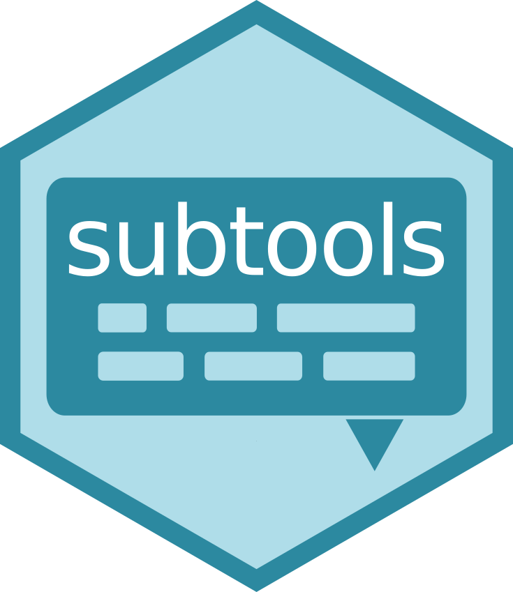

<!-- README.md is generated from README.Rmd. Please edit that file -->

# subtools

### Read, write and manipulate subtitles in R

### Install
To install the package from Gihub you can use devtools:

    devtools::install_github("fkeck/subtools")

### Demo
A quick introduction can be found [here](http://www.pieceofk.fr/?p=437).

### Applications
A list of cool projects using subtools.

*A tidy text analysis of Rick and Morty* by [tudosgar](https://twitter.com/tudosgar) ([link](http://tamaszilagyi.com/blog/a-tidy-text-analysis-of-rick-and-morty/))

*Rick and Morty and Tidy Data Principles* by [pachamaltese](https://twitter.com/pachamaltese)
([part 1](http://pacha.hk/2017-10-13_rick_and_morty_tidy_data.html))
([part 2](http://pacha.hk/2017-10-22_rick_and_morty_tidy_data_2.html))
([part 3](http://pacha.hk/2017-11-06_rick_and_morty_tidy_data_3.html))

--------------

*Term Frequencies by Season* by [tdawry](https://twitter.com/tdawry)
([link](https://twitter.com/tdawry/status/919055698427809792))

--------------

*You beautiful, naïve, sophisticated newborn series* by [ma_salmon](https://twitter.com/ma_salmon)
([link](http://www.masalmon.eu/2017/11/05/newborn-serie/))

--------------
