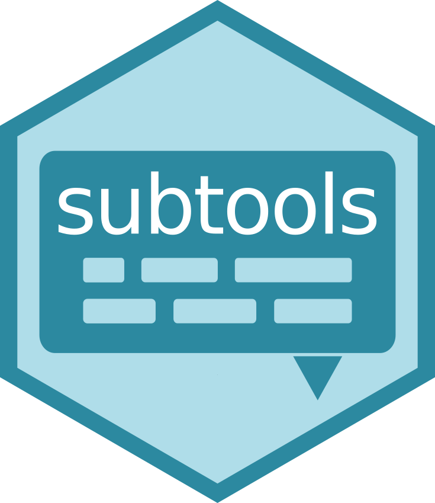

<!-- README.md is generated from README.Rmd. Please edit that file -->



# subtools

[](https://www.repostatus.org/#active)
[](https://github.com/albansagouis/subtools/actions/)

### Read, write and manipulate subtitles in R

Hi! Here, you will find some basic informations to get started with
`subtools`. For more details, you can check the package documentation.

Subtools is a R package to read, write and manipulate subtitles in R.
This then allows the full range of tools offered by the R ecosystem to
be used for the analysis of subtitles. With version `1.0`, `subtools`
integrates the main principles of the tidyverse and integrates directly
with `tidytext` for a tidy approach of subtitle text mining.

### Install

To install the package from Github you can use devtools:

``` r
devtools::install_github("fkeck/subtools")
```

``` r
library(subtools)
```

### Reading subtitles

The main goal of subtools is to provide a seamless way to import
subtitle files directly into R. This task can be performed with the
function `read_subtitles()`:

``` r
rushmore_sub <- read_subtitles("ex_Rushmore.srt")
oss_sub <- read_subtitles("ex_OSS_117.srt")
```

``` r
rushmore_sub
#> tibble [4, 4]
#> ID           chr 180 181 182 183
#> Timecode_in  hms 00:20:40.969 00:20:48.269 00:20:50.946 00:~
#> Timecode_out hms 00:20:48.269 00:20:50.87 00:20:57.37 00:21~
#> Text_content chr Rushmore deserves an aquarium. A first cla~

oss_sub
#> tibble [3, 4]
#> ID           chr 264 265 266
#> Timecode_in  hms 00:20:22.967 00:20:30.347 00:20:35.587
#> Timecode_out hms 00:20:27.427 00:20:32.297 00:20:37.697
#> Text_content chr Si vous voulez. Ça sera surtout l'occasion~
```

The function `read_subtitles()` returns an object of class `subtitles`.
This is a simple `tibble` with at least four columns (“`ID`”,
“`Timecode_in`”, “`Timecode_out`” and “`Text_content`”).

The metadata are handled by adding extra-columns which can be used
during the analysis. You can add metadata by adding columns manually
(e.g. using `mutate()`). You can also provide a 1-row data.frame of
metadata to the function `read_subtitles()`.

``` r
bb_meta <- data.frame(Name = "Breaking Bad", Season = 1, Episode = 1)
bb_sub <- read_subtitles("ex_Breaking_Bad.srt", metadata = bb_meta)
```

``` r
bb_sub
#> tibble [5, 7]
#> ID           chr 5 6 7 8 9
#> Timecode_in  hms 00:01:09.236 00:01:15.993 00:01:18.829 00:~
#> Timecode_out hms 00:01:12.78 00:01:18.661 00:01:21.205 00:0~
#> Text_content chr Oh, my God. Christ! Shit. [SIRENS WAILING ~
#> Name         chr Breaking Bad Breaking Bad Breaking Bad Bre~
#> Season       dbl 1 1 1 1 1
#> Episode      dbl 1 1 1 1 1
```

##### Series

If you want to analyze subtitles of series with different seasons and
episodes, you will have to import many files at once. The
`read_subtitles_season()`, `read_subtitles_serie()` and
`read_subtitles_multiseries()` functions can make your life much easier,
by making it possible to automatically import files and extract metadata
from a structured directory. You can check the manual for more details.

##### MKV

Finally if you have a collection of movies in .mkv format, you can
extract the subtitle tracks of MKV files with `read_subtitles_mkv()`.

### Cleaning subtitles

Often, the workflow begins with a cleaning step to get rid of irrelevant
information that might be present in text content. Three functions can
be used for this task. First, `clean_tags()` cleans formatting tags. By
default, this function is automatically executed by the
`read_subtitles*()` functions, so you probably don’t need to run it
again. Second, `clean_captions()` can be used to supress closed
captions, i.e. descriptions of non-speech elements in parentheses or
squared brackets. Finally, `clean_patterns()` is a more general function
to clean subtitles based on regex pattern matching.

``` r
bb_sub
#> tibble [5, 7]
#> ID           chr 5 6 7 8 9
#> Timecode_in  hms 00:01:09.236 00:01:15.993 00:01:18.829 00:~
#> Timecode_out hms 00:01:12.78 00:01:18.661 00:01:21.205 00:0~
#> Text_content chr Oh, my God. Christ! Shit. [SIRENS WAILING ~
#> Name         chr Breaking Bad Breaking Bad Breaking Bad Bre~
#> Season       dbl 1 1 1 1 1
#> Episode      dbl 1 1 1 1 1

bb_sub_clean <- clean_captions(bb_sub)
bb_sub_clean
#> tibble [4, 7]
#> ID           chr 5 6 8 9
#> Timecode_in  hms 00:01:09.236 00:01:15.993 00:01:24.918 00:~
#> Timecode_out hms 00:01:12.78 00:01:18.661 00:01:27.378 00:0~
#> Text_content chr Oh, my God. Christ! Shit. Oh, God. Oh, my ~
#> Name         chr Breaking Bad Breaking Bad Breaking Bad Bre~
#> Season       dbl 1 1 1 1
#> Episode      dbl 1 1 1 1
```

### Binding subtitles

Sometimes you will need to bind several subtitle objects together. This
can be achieved with the function `bind_subtitles()`. This function is
very similar to `bind_rows` from `dplyr` (they both bind rows of
tibbles), but `bind_subtitles()` allows to recalculate timecodes to
follow concatenation order (this can be disabled by setting `sequential`
to `FALSE`).

``` r
bind_subtitles(rushmore_sub, oss_sub, bb_sub_clean)
#> tibble [11, 7]
#> ID           chr 180 181 182 183 264 265 266
#> Timecode_in  hms 00:20:40.969 00:20:48.269 00:20:50.946 00:~
#> Timecode_out hms 00:20:48.269 00:20:50.87 00:20:57.37 00:21~
#> Text_content chr Rushmore deserves an aquarium. A first cla~
#> Name         chr NA NA NA NA NA NA NA
#> Season       dbl NA NA NA NA NA NA NA
#> Episode      dbl NA NA NA NA NA NA NA
```

Some functions under certain conditions can also return a list of
subtitle objects (class `multisubtitles`). The function
`bind_subtitles()` can also be used on such object to bind each elements
into a new subtitle object, i.e. something similar to
`do.call(rbind, x)`.

``` r
multi_sub <- bind_subtitles(rushmore_sub, bb_sub_clean, collapse = FALSE, sequential = FALSE)
multi_sub
#> A multisubtitles object with 2 elements
#> subtitles object [[1]]
#> tibble [4, 4]
#> ID           chr 180 181 182 183
#> Timecode_in  hms 00:20:40.969 00:20:48.269 00:20:50.946 00:~
#> Timecode_out hms 00:20:48.269 00:20:50.87 00:20:57.37 00:21~
#> Text_content chr Rushmore deserves an aquarium. A first cla~
#> 
#> 
#> subtitles object [[2]]
#> tibble [4, 7]
#> ID           chr 5 6 8 9
#> Timecode_in  hms 00:01:09.236 00:01:15.993 00:01:24.918 00:~
#> Timecode_out hms 00:01:12.78 00:01:18.661 00:01:27.378 00:0~
#> Text_content chr Oh, my God. Christ! Shit. Oh, God. Oh, my ~
#> Name         chr Breaking Bad Breaking Bad Breaking Bad Bre~
#> Season       dbl 1 1 1 1
#> Episode      dbl 1 1 1 1

bind_subtitles(multi_sub)
#> tibble [8, 7]
#> ID           chr 180 181 182 183 5 6 8
#> Timecode_in  hms 00:20:40.969 00:20:48.269 00:20:50.946 00:~
#> Timecode_out hms 00:20:48.269 00:20:50.87 00:20:57.37 00:21~
#> Text_content chr Rushmore deserves an aquarium. A first cla~
#> Name         chr NA NA NA NA Breaking Bad Breaking Bad Brea~
#> Season       dbl NA NA NA NA 1 1 1
#> Episode      dbl NA NA NA NA 1 1 1
```

### Tidying subtitles

The [tidy text format](https://www.tidytextmining.com/tidytext.html) as
defined by Julia Silge and David Robinson is a table with
one-token-per-row, a token being a meaningful unit of text, such as a
word or a sentence. The objects returned by `read_subtitles*()` are in
some ways already tidy (each row being a subtitle block associated with
a timecode). However, this unit is not always the most relevant for data
analysis. To perform tokenization, the `tidytext` package provides the
generic function `unnest_tokens()`. The package `subtools` adds a new
method to `unnest_tokens()` to handle subtitles objects. The main
difference with the `data.frame` method is the possibility to perform
timecode remapping according to the tokenisation process.

``` r
rushmore_sub
#> tibble [4, 4]
#> ID           chr 180 181 182 183
#> Timecode_in  hms 00:20:40.969 00:20:48.269 00:20:50.946 00:~
#> Timecode_out hms 00:20:48.269 00:20:50.87 00:20:57.37 00:21~
#> Text_content chr Rushmore deserves an aquarium. A first cla~

unnest_tokens(rushmore_sub)
#> tibble [49, 4]
#> ID           chr 180 180 180 180 180 180 180
#> Timecode_in  hms 00:20:40.97 00:20:41.4868 00:20:42.0036 00~
#> Timecode_out hms 00:20:41.4858 00:20:42.0026 00:20:42.1318 ~
#> Text_content chr rushmore deserves an aquarium a first class

unnest_tokens(bb_sub_clean, token = "sentences")
#> tibble [8, 7]
#> ID           chr 5 5 6 8 8 9 9
#> Timecode_in  hms 00:01:09.237 00:01:11.4028 00:01:15.994 00~
#> Timecode_out hms 00:01:11.4018 00:01:12.78 00:01:18.661 00:~
#> Text_content chr oh, my god. christ! shit. oh, god. oh, my ~
#> Name         chr Breaking Bad Breaking Bad Breaking Bad Bre~
#> Season       dbl 1 1 1 1 1 1 1
#> Episode      dbl 1 1 1 1 1 1 1
```

Note that unlike the `data.frame` method, the `input` and `output`
arguments are optional. This is because here the `Text_content` column
can be assumed to be the column of interest.

Once your data are ready, you can analyze them. I recommend you to have
a look at [Text Mining with R: A Tidy
Approach](https://www.tidytextmining.com/) by Julia Silge and David
Robinson. This is a great place to get started with text mining in R.

### Applications

A list of cool projects using `subtools`.

Note that these project used the branch 0.x of `subtools`. The API is
totally different in `subtools 1.0`.

[*You beautiful, naïve, sophisticated newborn
series*](https://www.masalmon.eu/2017/11/05/newborn-serie/) by
[ma_salmon](https://twitter.com/ma_salmon)

[*A tidy text analysis of Rick and
Morty*](http://tamaszilagyi.com/blog/2017/2017-10-07-tidyrick/) by
[tudosgar](https://twitter.com/tudosgar)

[*Term Frequencies by
Season*](https://twitter.com/tdawry/status/919055698427809792) by
[tdawry](https://twitter.com/tdawry)
